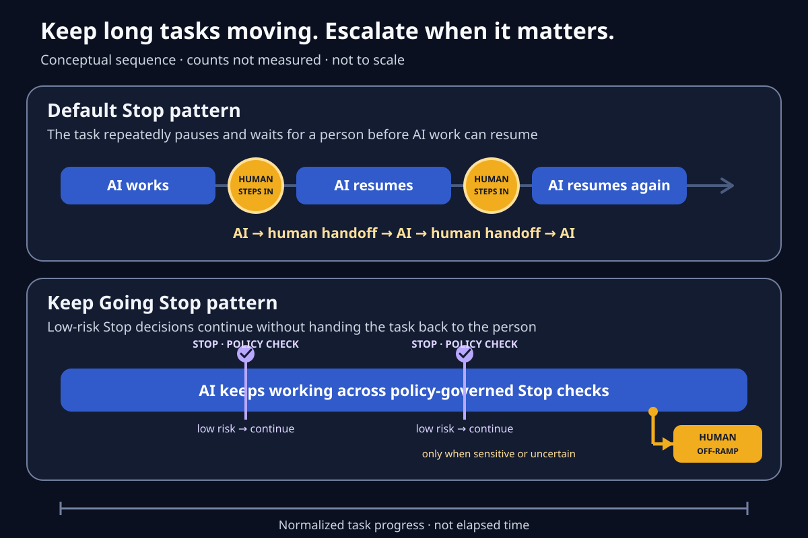

# Keep Going

English | [简体中文](README.zh.md)

**Keep long tasks moving. Escalate when it matters.**

Keep Going is a policy-driven Stop-hook harness for Claude Code and Codex. At each stop, it uses bounded session context and a user-owned decision policy to either inject a low-risk continuation or return control to the human.



> Conceptual interaction model — not measured performance. The tracks show normalized task progress, not elapsed time. Keep Going does not claim a specific reduction in interruptions, completion time, or success rate.

## What Keep Going does

Keep Going sits at the host's Stop hook. It does not own the agent's planner, task state, checkpointing, permissions, or definition of done.

At a Stop event it:

1. Builds a bounded decision context from the current session transcript.
2. Sends the selected context and user-owned decision policy to the configured Claude or Codex model backend.
3. Normalizes the model response into `allow`, `block`, or `escalate`.
4. Applies a deterministic safety gate that the model cannot override.
5. Injects a continuation only when the decision is low risk and sufficiently supported; otherwise it returns control to the human.

```text
Stop event
  -> bounded session context + decision policy
  -> configured model backend
  -> deterministic safety gate
     -> low-risk continuation: inject reply
     -> uncertainty / sensitive action: return control
```

## Deterministic safety boundary

The safety gate runs after model output and before any reply reaches the host agent. It prevents continuation when:

- the decision category is `authorization` or `information`;
- the session context contains a high-risk or irreversible-action flag;
- a `block` decision has confidence below `0.6`;
- the transcript is missing or unreadable;
- the model output is malformed, contradictory, or has an empty continuation;
- the configured continuation-chain depth is exhausted.

Keep Going does not bypass Claude Code or Codex permissions. Host permission prompts and platform controls remain authoritative.

## Privacy model

The repository tracks only the public policy template: [`artifacts/decision-policy.template.yaml`](artifacts/decision-policy.template.yaml). These local files are ignored and rejected by the privacy gate if they enter Git:

- `data/` and harvested session material;
- `artifacts/decision-policy.yaml`;
- `artifacts/decision-policy.runtime.yaml`;
- candidate policies, logs, local configuration, and unapproved media.

Policies, events, and compiled runtime artifacts are persisted locally for review. For each Stop decision, however, the configured model backend receives the selected policy and bounded context. Do not place secrets in a policy, and review the backend's data handling before enabling the hook.

The runtime policy is a persisted, deterministic compilation of the local canonical policy. A missing, stale, or manually changed runtime fails explicitly; Keep Going does not silently project or fall back.

## Quick start from source

Requirements: Python 3.11+, [`uv`](https://docs.astral.sh/uv/), and an authenticated Claude Code or Codex CLI for model-backed Stop decisions.

```bash
uv sync
cp artifacts/decision-policy.template.yaml artifacts/decision-policy.yaml
# Review and personalize the conservative local policy before compiling it.
uv run keep-going compile-policy
uv run keep-going bridge self-test --project "$PWD" --json-output
```

Install or refresh the host integration, enable the project Stop hook, and verify the loaded surface:

```bash
uv run keep-going start --project "$PWD" --host codex
uv run keep-going bridge status --project "$PWD" --json-output
uv run keep-going bridge self-test --project "$PWD" --json-output
```

`keep-going start` writes user-level agent, plugin, marketplace, native-hook integration, and project state. In this source workflow, the checkout remains the active runtime. Review the installation plan with `uv run keep-going install` first if you do not want those user-level writes yet.

The source workflow can optionally harvest and distill local conversations:

```bash
uv run keep-going harvest --window-days 90
uv run keep-going classify
uv run keep-going sample-themes
uv run keep-going distill --out artifacts/decision-policy.candidate.yaml
# Human-review the candidate before updating the local canonical policy.
uv run keep-going compile-policy
```

## Review and verification

```bash
uv run pytest -q
uv run keep-going audit --smoke --json-output
uv run python scripts/privacy-audit.py --history
npm --prefix packages/npm test
```

For a manual Stop-event probe that does not write metrics, pass `--synthetic --json-output` to `keep-going bridge stop-hook --input-json` and include the real host-provided transcript path in the event.

The privacy audit rejects private policy artifacts, session/log formats, real user-home paths, non-placeholder email addresses, secrets, archives, and media outside an exact reviewed asset manifest.

## Integration surfaces

- `keep-going bridge`: project-level Stop-hook activation and self-test
- `keep-going reply`: direct decision-policy reply
- `keep-going hook`: host-neutral hook policy entrypoint
- `keep-going mcp`: MCP stdio server
- `keep-going eval`, `conformance`, `overrides`: quality feedback loops
- `keep-going agent`: named policy-agent management
- `keep-going install`, `sync-local`, `audit`: installed-surface lifecycle

Development boundaries and the validation matrix live in [`AGENTS.md`](AGENTS.md).

## License

No license is granted. This repository is source-visible for review; reuse,
modification, and redistribution require permission from the copyright holder.
